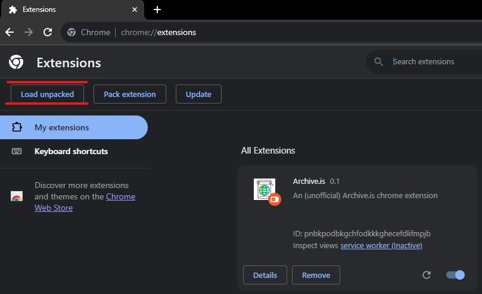
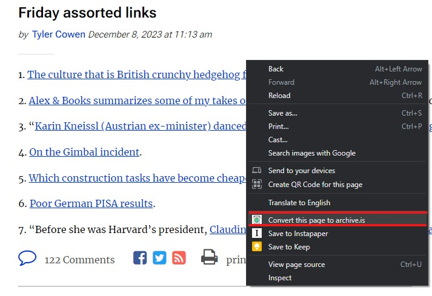
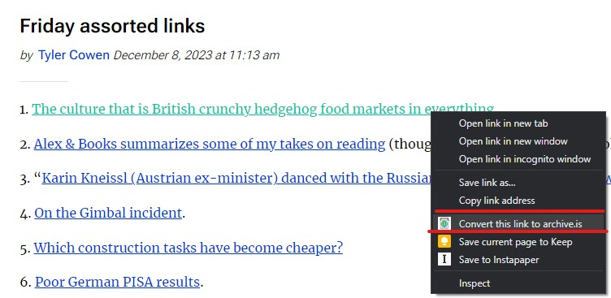
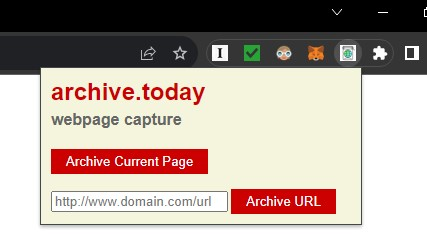

### An (unofficial) Archive.is chrome extension

Adds two context menu items: one to archive the current page, and another to archive a selected link, allowing you to archive a page without visiting it first (desirable if you do not want to give the target page your traffic.)

  
**Installation Guide**
1. Open your terminal, navigate to the folder of your choice, and enter the following command:
```
git clone https://github.com/JR-Vickers/archive.is-chrome-extension.git
```

2. Visit the following page in your Chrome or Brave browser:
```
chrome://extensions/
```

3. Click "Load unpacked" and select the folder that you cloned the files into.


4. The extension is now installed.  There are a few options for converting a webpage into archive.is.  First, you can right-click anywhere on the page:


	Second, you can right-click a link to archive a page without opening it:
    

	Third, you can use the extension button:
    

	That's everything you need to know.  Enjoy!